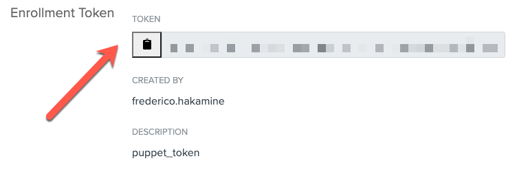
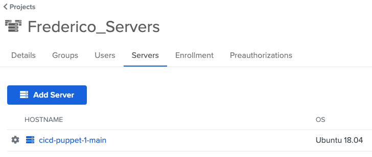
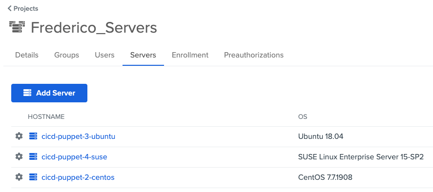

# asa-puppet-example

This repo provides a sample of a Puppet code for enrolling and securing access to servers with Okta Advanced Server Access (ASA).

To leverage this example, you must have access to the Puppet primary server and Okta ASA as administrator.

**NOTE:** If you don’t have an Okta ASA account yet, you can go and [create one here](https://app.scaleft.com/p/signup).

# How to use this sample

**Important**: These steps are simplified to focus on how servers can be automatically enrolled in ASA via Puppet. Your environment may require different steps on yoour Puppet deployment structure, use of additional tools – i.e. Bolt, Hiera, secret management tools..., and best practices.

Step 1: Clone this repository:

```
git clone https://github.com/sudobinbash/asa-puppet-example.git
cd asa-puppet-example
```

Step 2: Get an Enrollment token in ASA:

1. Access Okta ASA as Administrator.
2. Click **Projects** and then select or create a new project.
3. Click **Enrollment** > **Create Enrollment Token**.
4. Enter a name (i.e. `puppet-token`) and click **Submit**.
5. Copy the enrollment token.



Step 3: Edit and test the example:

1. Edit the `okta-asa-sample.pp` file and update line 2, with the asa enrollment token.
2. Validate the example syntax: `puppet parser validate okta-asa-sample.pp`
3. Test the example in the primary server (without executing the change): `puppet apply asa.pp --noop`

Step 4: (Optional) Enroll the Puppet primary server in ASA:

1. Run the command: `puppet apply asa.pp`
2. To confirm the primary server is enrolled, check the list of servers in ASA:



Step 5: (Optional) Enroll other servers in ASA:

1. Copy the sample manifest to the environment folder: `cp okta-asa-sample.pp /etc/puppetlabs/code/environments/production`
2. Access your puppet clients and execute the command `puppet agent -tv` (or wait until the clients fetch the new configuration from the primary server).
3. The Puppet client will fetch the manifest, install and configure ASA, and return the following:
```
root@cicd-puppet-3-ubuntu:~# puppet agent -tv
Info: Using configured environment 'production'
Info: Retrieving pluginfacts
Info: Retrieving plugin
Info: Loading facts
Info: Caching catalog for cicd-puppet-3-ubuntu.acme.com
Info: Applying configuration version '1608162283'
Notice: /Stage[main]/Enroll_server/File[/var/lib/sftd/enrollment.token]/ensure: defined content as '{sha256}c2b2863475dea7b22cd77db064f0d938225870eabd5b51f33ecd79474d7f5994'
Info: /Stage[main]/Enroll_server/File[/var/lib/sftd/enrollment.token]: Scheduling refresh of Service[sftd]
Notice: /Stage[main]/Enroll_server/Service[sftd]: Triggered 'refresh' from 1 event
```

4. In ASA, you will see the servers enrolled in your project:




## Power Tips / FAQ

**Wait... what does the `okta-asa-sample.pp` do?**

The example installs the ASA server agent and then enroll your servers into ASA for remote access.

The example supports different Linux distros using the server distro family fact:

```
#Class for installing ASA
class asa_setup {
    if $facts['os']['family'] == 'Debian' {
        notice("This is: ${::osfamily} - ${::fqdn}")
        include install_deb
    }
    elsif $facts['os']['family'] == 'RedHat' {
        notice("This is: ${::osfamily} - ${::fqdn}")
        include install_rpm
    }
    elsif $facts['os']['family'] == 'Suse' {
        notice("This is: ${::osfamily} - ${::fqdn}")
        include install_rpm
    }
    else {
        notice("This sample doesn't work yet on: ${::osfamily} - ${::fqdn}")
    }
}
```

The steps for enrolling the servers are the same across all Linux distros.

**How do I define the server names listed in ASA? (aka Canonical Names)**

Servers are registered in ASA with a canonical name that can be used to launch ssh sessions (i.e. `ssh <canonical-name>`). Our sample uses the machine hostname `hostname` as canonical name. You can change the canonical name according to your preferences, using your own variables or other server facts, such as the `fqdn`.

```
$canonical_file = "---
# CanonicalName: Specifies the name clients should use/see when connecting to this host.
CanonicalName: \"${::hostname}\"
"
...
file { "/etc/sft/sftd.yaml":
    ensure => "present",
    content => $canonical_file
}
```
